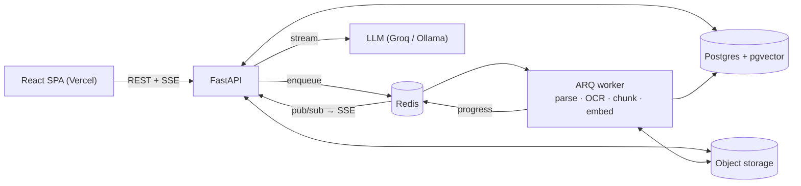

# DocMind

**Ask questions across your documents. Every answer streams in live and cites the exact
document and page it came from.**

Multi-tenant RAG for teams: shared workspaces with roles, hybrid search with reranking, OCR,
streaming answers with clickable citations, and measured retrieval quality. Built and hosted
entirely on free tiers.

**[Live demo](https://YOUR-APP.vercel.app)** · **Try the demo** button, no sign-up ·
[API docs](https://YOUR-HF-USERNAME-docmind-api.hf.space/docs)

[](https://github.com/Rounak-Raghuwanshi/docmind/actions/workflows/ci.yml)


<!-- Record a 20-second GIF: upload a PDF → ask → click a citation. Save as docs/demo.gif -->


---

## Why

People lose hours searching long PDFs: tax law, GST circulars, policies, manuals. Generic
chatbots answer from memory and can't show their source. DocMind answers **only** from your
documents, cites every claim, and says *"I couldn't find this in your documents"* instead of
guessing.

The demo is pitched at **Indian tax and compliance** (the Income Tax Act, GST circulars and CBDT
FAQs), where precise section numbers matter and being able to verify an answer is the point.

## Features

**Core:** sign-up/login with rotating refresh tokens · personal and team workspaces · upload
of PDF, DOCX, TXT and Markdown (drag and drop, ≤ 20 MB) · background ingestion with live
progress · chat over all documents or a chosen subset · token-by-token streaming with a
**Stop** button · numbered citation chips that open the PDF **at the cited page with the
passage highlighted** · conversation history with auto-generated titles · an honest "not found".

**What makes it more than a tutorial:**

| | |
| --- | --- |
| **Hybrid retrieval** | pgvector HNSW search ‖ Postgres full-text search, fused with **Reciprocal Rank Fusion**, then a **cross-encoder reranker** |
| **Relevance gate** | If the best rerank score falls below a threshold tuned on the eval set, the app answers "not found" without calling the LLM |
| **Measured quality** | An eval harness reports **Hit@5 / MRR** for four retrieval configurations, plus a debug view of every chunk's scores |
| **Team workspaces** | Owner / editor / viewer roles, single-use invite links, and tenant isolation enforced in every SQL query (strangers get 404, not 403) |
| **Async ingestion** | Redis job queue, OCR fallback for scanned pages, header/footer stripping, structure-aware chunking, idempotent retries, crash recovery |
| **Security** | bcrypt, 15-minute JWTs kept in memory only, refresh-token **rotation with reuse detection**, sliding-window rate limits, magic-byte upload checks, prompt-injection defence |
| **AI insights** | A 3D PCA map of the embedding space (Three.js), how hybrid search found each cited passage, reranker-confidence distribution, and knowledge gaps |
| **Modern UI** | A 3D landing scene and auth panel (React Three Fiber), motion and tilt effects (Framer Motion), dark mode, mobile layout, reduced-motion support |
| **Operations** | JSON logs with request IDs, health and readiness probes, an analytics dashboard (latency, not-found rate, cache hits, feedback), CI/CD to free hosting |

## Retrieval quality

Measured with [`eval/run_eval.py`](eval/README.md) on a hand-written set of 50 questions with
known answer pages, over the demo corpus.

| Configuration | Hit@5 | MRR |
| --- | --- | --- |
| Vector only | _X%_ | _0.XX_ |
| Keyword only (full-text) | _X%_ | _0.XX_ |
| Hybrid (RRF) | _X%_ | _0.XX_ |
| **Hybrid + rerank** | **_X%_** | **_0.XX_** |

<!-- Replace with your numbers and one sentence on why, e.g.: "Keyword search alone misses
paraphrases; vectors alone miss exact section numbers like 80D; fusion recovers both and the
cross-encoder fixes the ordering." -->

## Architecture



1. **Upload:** the file is validated, stored and queued, and the API returns 202 in
   milliseconds.
2. **Ingest (worker):** parse page by page → OCR empty pages → strip running headers → chunk
   by heading, paragraph and sentence (~400 tokens, sentence overlap, page-aware) → embed with
   `bge-small-en-v1.5` → swap the chunks in one transaction → bump the corpus version.
3. **Ask:** rewrite follow-ups into standalone questions → check the cache → vector and
   keyword search concurrently → RRF → rerank → relevance gate → stream the LLM answer →
   validate `[n]` citations → save the answer with timings.

Design decisions and trade-offs, with interview-style Q&A, are in
**[docs/ARCHITECTURE.md](docs/ARCHITECTURE.md)**.

## Tech stack

| Layer | |
| --- | --- |
| Frontend | React 18, TypeScript (strict), Vite, Tailwind CSS v4, TanStack Query, Zustand, react-pdf, Recharts, Three.js + React Three Fiber, Framer Motion |
| Backend | FastAPI, Pydantic v2, SQLAlchemy 2 (async) + asyncpg, Alembic, ARQ |
| Data | PostgreSQL 16 + pgvector (HNSW, GIN full-text), Redis |
| ML | fastembed (ONNX, CPU): `BAAI/bge-small-en-v1.5` embeddings, `ms-marco-MiniLM-L-6-v2` cross-encoder; PyMuPDF; Tesseract OCR |
| LLM | Any OpenAI-compatible API: Ollama locally, Groq or Gemini in production |
| Quality | pytest (81 tests, ~91% coverage, real Postgres + Redis), Vitest + Testing Library, ruff, mypy, ESLint, Prettier |
| Delivery | GitHub Actions → Hugging Face Spaces (Docker) + Vercel; Supabase (Postgres + Storage) |

## Run it locally

You need Python 3.12, Node 20+, and Postgres with pgvector and Redis (Homebrew or Docker). The
full walkthrough is in **[docs/LOCAL_SETUP.md](docs/LOCAL_SETUP.md)**.

```bash
make setup        # venv, pip install, npm install, creates backend/.env
make migrate      # create the schema
make seed         # demo users, documents, chats and 30 days of usage (password Demo@12345)
make dev          # API :8000 · worker · web :5173
```

Open <http://localhost:5173>. No GPU is needed, and `LLM_PROVIDER=fake` runs the whole app
without any LLM.

## Deploy it (₹0)

Supabase (Postgres + pgvector + Storage) · Hugging Face Space (API, worker and models in one
Docker container) · Vercel (frontend, with a same-origin `/api` rewrite) · Groq (LLM).
Step-by-step instructions: **[docs/DEPLOYMENT.md](docs/DEPLOYMENT.md)**. Every setting is listed in
[docs/CONFIGURATION.md](docs/CONFIGURATION.md).

## Project layout

```
backend/
  app/
    routers/        HTTP only: auth, workspaces, documents, chat, search & analytics, health
    services/       business logic: auth, ingestion, retrieval, chat (SSE), cache, storage, rate limits
    repositories/   SQL: retrieval queries, analytics, documents, workspaces
    rag/            parser, OCR, cleaner, chunker, embedder, reranker, RRF, prompts, citations
    llm/            OpenAI-compatible client + FakeLLM
    workers/        ARQ jobs: ingest, enrich, title, cleanup
  migrations/       Alembic
  tests/            unit/ + integration/ (real Postgres + Redis)
frontend/src/
  api/              typed API hooks (TanStack Query)
  features/         auth · chat · documents · workspaces · analytics
  lib/sse.ts        fetch-based SSE client (POST + auth + abort)
eval/               run_eval.py, dataset, results
docs/               setup, deployment, configuration, architecture
```

## Use cases

- **Tax & compliance teams:** cited answers from the Income Tax Act, GST circulars and CBDT FAQs
- **Engineering teams:** ask runbooks ("first 15 minutes of a SEV1?"), API guidelines and
  onboarding docs. The demo ships an *Engineering Handbook* workspace.
- **Support and on-call:** search manuals and past postmortems, and paste the citation into the ticket
- **Platform use:** `POST /api/workspaces/{ws}/search` is retrieval-only, so a Slack bot, CLI or
  IDE plugin can reuse the same search

## Documentation

| | |
| --- | --- |
| [LOCAL_SETUP.md](docs/LOCAL_SETUP.md) · [DEPLOYMENT.md](docs/DEPLOYMENT.md) · [CONFIGURATION.md](docs/CONFIGURATION.md) | Run it, ship it, configure it |
| [ARCHITECTURE.md](docs/ARCHITECTURE.md) | Design decisions and trade-offs |
| [COMPLETE_GUIDE_HINGLISH.md](docs/COMPLETE_GUIDE_HINGLISH.md) | The whole approach, a feature tour and interview prep (Hinglish) |
| [CONCEPTS_HINGLISH.md](docs/CONCEPTS_HINGLISH.md) | Every backend, frontend, AI and DevOps concept from scratch (Hinglish) |
| [BACKEND_EXPLAINED.md](docs/BACKEND_EXPLAINED.md) | Every backend part in depth, including how RAG and the LLM are used (Hinglish) |
| [FRONTEND_EXPLAINED.md](docs/FRONTEND_EXPLAINED.md) | Every frontend part in depth: streaming, PDF highlight, dialogs, animations, 3D (Hinglish) |
| [HOW_AI_BUILT_THIS.md](docs/HOW_AI_BUILT_THIS.md) | How an AI coding agent was used, honestly |

## Testing

```bash
cd backend && .venv/bin/pytest --cov    # unit + integration against real Postgres/pgvector and Redis
cd frontend && npm test                 # SSE parser, citation chips, upload validation
```

The integration tests cover refresh-token rotation and reuse detection, role checks (a viewer
gets 403 on upload, a stranger gets 404 everywhere), upload → ingestion → ready with correct
page numbers, cross-workspace search isolation, streamed answers with valid citations, the
"not found" gate, cache invalidation when documents change, Stop saving a partial answer,
worker retries and crash recovery, and rate limiting. They use a deterministic fake LLM,
embedder and reranker, so they're free and offline.
